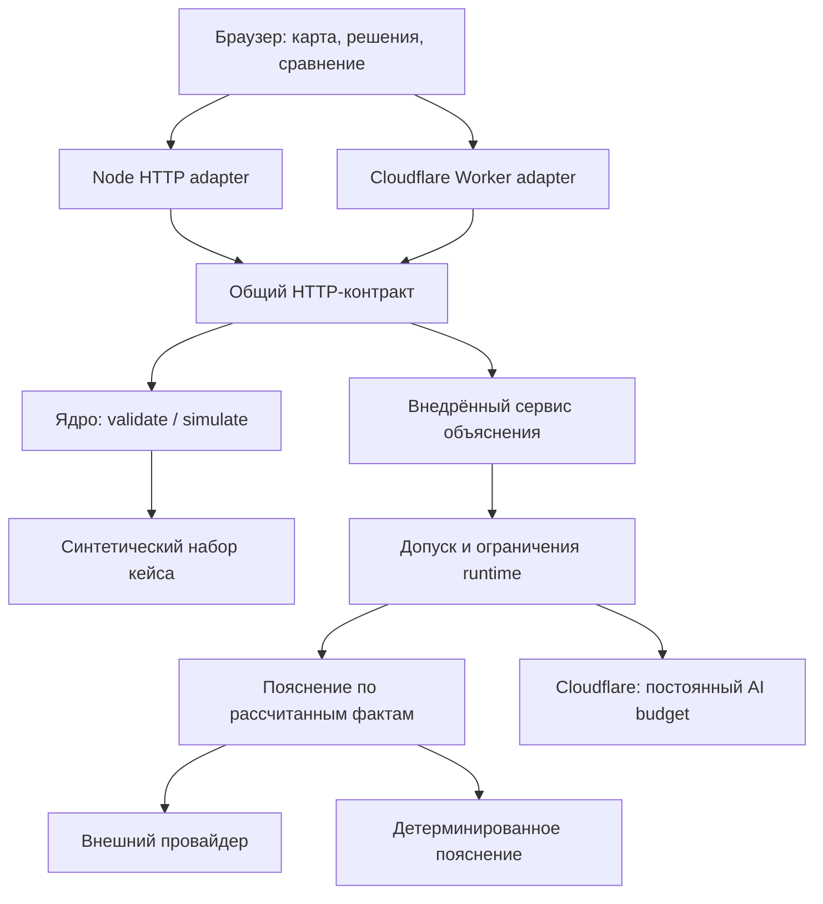

# Архитектура приложения

Приложение — модульный монолит с двумя HTTP-адаптерами: Node.js для локального запуска и Cloudflare Worker для публичного демо. Оба используют один контракт API и одно детерминированное ядро. Основной критерий разделения — возможность изменить транспорт или способ объяснения, сохранив формулу, валидацию и HTTP-поведение.



## Ответственность модулей

| Модуль | Ответственность | Граница |
| --- | --- | --- |
| `data/city.json` | Официальные синтетические исходные значения, меры и правила | Клиент не заменяет этот набор через API |
| `src/core/simulator.js` | Валидация, бюджет, эффекты, задержки, синергии и Score | Без HTTP, DOM, сети, секретов и хранилищ |
| `src/core/policy-options.js` | Подбор вариантов с проверкой через тот же симулятор | Не создаёт вторую формулу расчёта |
| `src/http/api.js` | Маршруты, методы, статусы, повторный расчёт перед объяснением | Получает `readJson`, `explain` и сведения о запросе через аргументы |
| `src/http/policy.js`, `json.js`, `errors.js` | Заголовки, проверка пути и источника запроса, ограничение JSON, безопасные ошибки | Общие правила для обоих адаптеров; без Node- и Cloudflare-импортов |
| `src/server.js` | Node HTTP, потоки запроса/ответа, раздача файлов из `public` | Не реализует формулу и список API заново |
| `src/runtime/node-origin.js` | Доверенный публичный origin для Node за TLS proxy | Конфигурация окружения имеет приоритет над внутренней HTTP-схемой; forwarding headers не используются |
| `src/worker.js` | Web Request/Response, чтение потока, Assets binding | Делегирует API и объяснение общим/внедрённым модулям |
| `src/runtime/node-explanation.js`, `worker-explanation.js` | Ключи и конфигурация runtime, допуск к провайдеру, освобождение слотов | Различия локального процесса и распределённого развёртывания явны |
| `src/runtime/local-ai-guard.js` | Ограничения частоты, общего числа и одновременных обращений в одном экземпляре | Не выдаётся за постоянный глобальный счётчик |
| `src/ai/explain.js` | Факты симулятора, структурированное объяснение, timeout и fallback | Текст не изменяет результат симулятора |
| `src/ai-budget.js`, `src/cloudflare.js` | Проверяемая модель постоянной квоты и её Durable Object адаптер | SQL-транзакция допуска отделена от внешнего сетевого вызова |
| `public/` | Представление, карта, сравнение, локальная библиотека сценариев | Любой импортированный сценарий заново проверяет сервер |

## Решения и компромиссы

**Функциональное ядро и внешние адаптеры.** Данные и сценарий определяют числовой результат; HTTP и AI не участвуют в формуле. Тесты проверяют независимость результата от порядка решений, отсутствие изменения входа и сохранность исходного набора. Это позволяет одинаково проверять расчёт в локальном и облачном окружении.

**Внедрение зависимостей через фабрики и функции.** `createRequestHandler`, `createAppServer`, `createWorker` и сервисы объяснения принимают необходимые зависимости. Тесты подставляют транспорт провайдера, часы и хранилище, поэтому ошибки сети и конкурентные запросы воспроизводимы без настоящего ключа. Контейнер зависимостей и иерархия базовых сервисов для этого объёма не нужны.

**Один контракт приложения.** Обработчик `handleApiRequest` возвращает `{status, body, headers?}`; адаптер преобразует его в ответ своего runtime. `RequestError` представляет ожидаемую ошибку запроса. Неожиданная ошибка преобразуется в общий ответ без стека, абсолютного пути и внутренних подробностей.

**Объяснение как необязательная возможность.** API сначала рассчитывает сценарий на сервере. Затем сервис допуска решает, можно ли обращаться к провайдеру. При отсутствии ключа, квоты, доступного хранилища или успешного ответа сохраняется детерминированное пояснение с явным `mode: 'deterministic'`. Пользовательский расчёт от AI не зависит.

**Ограниченный объём состояния.** Сравнение A/B живёт в памяти страницы; библиотека сценариев — в браузерном хранилище с явными ошибками записи. Импорт принимает решения, отбрасывая чужие результаты и текст объяснения. Общего серверного хранилища пользовательских сценариев и учётных записей нет. Постоянное облачное состояние используется для допуска платных запросов.

**Расчёт и география разделены.** Карта может показать другую территорию, но модельные показатели относятся только к синтетическому набору Астаны. Подключение реального города требует проверенных местных данных и правил, а не переноса имеющихся значений на новую карту.

## Инварианты

1. Только симулятор определяет допустимость сценария, стоимость и итоговые показатели; клиентские бюджет, Score и эффекты не принимаются как истина.
2. Перед AI-пояснением выполняется новый серверный расчёт; провайдер получает подготовленные факты.
3. Успех `/api/validate` означает выполненную проверку, поэтому невалидный черновик возвращает 200 с ошибками. Невалидные `/api/simulate` и `/api/explain` возвращают 422.
4. JSON ограничен 32 KiB по фактически прочитанным байтам, независимо от заявленного `Content-Length`.
5. Допуск к платному запросу учитывается до внешнего вызова. Освобождение слота не возвращает общий лимит попыток.
6. Статика и динамические ответы используют согласованные защитные заголовки; секреты остаются на сервере.

## Как проверяется качество

Из корня репозитория с Node.js 24:

```sh
node scripts/check-quality.js
npm test
```

`check-quality.js` выполняет `node --check` для собственного JavaScript в `src`, `public`, `tests` и `scripts`. Для статических импортов используется парсер V8 (`vm.SourceTextModule`), а не поиск синтаксиса регулярными выражениями. Проверяются существование относительных целей, выход за корень репозитория и направления зависимостей: ядро → ядро/данные, HTTP → HTTP/ядро, AI → AI/ядро, браузерный исходник → браузерные модули/ядро/данные, публичные модули → публичные модули. Заголовки из `public/_headers` сравниваются с `SECURITY_HEADERS`. Это ограниченная архитектурная проверка, не проверка типов и не полноценный linter.

Поставляемая библиотека `public/vendor/**` и сгенерированный `public/policy-options-worker.js` исключены из проверки собственного исходного кода. Проверка не исполняет анализируемые модули; отдельно импортируется только модуль общих политик для чтения заголовков. Динамические импорты, глобальные побочные эффекты, корректность сгенерированного bundle и интерфейс требуют тестов и review. Экспериментальный VM API включается только в дочернем процессе проверки; приложение этого флага не требует. См. [Node.js: проверка синтаксиса](https://nodejs.org/api/cli.html#-c---check) и [SourceTextModule](https://nodejs.org/api/vm.html#class-vmsourcetextmodule).

Workflow `.github/workflows/quality.yml` запускает эти команды на Node.js 24 в Linux и Windows; при наличии `package-lock.json` предварительно выполняет `npm ci` для зафиксированных зависимостей сборки. Права ограничены чтением репозитория, credential persistence выключен, actions закреплены полными SHA. Эти меры соответствуют [рекомендациям GitHub для безопасного CI](https://docs.github.com/en/actions/reference/security/secure-use). Workflow проверяет исходники и тесты; публикация и проверка живой карты выполняются отдельно.

Поведенческие проверки сгруппированы по контрактам: `simulator.acceptance.test.js` — официальные числа и правила; `policy-options.test.js` — корректность альтернатив; `server.test.js` и `worker.test.js` — HTTP-адаптеры; `http-contract.test.js` — согласованность общего HTTP-контракта; `explain.test.js` — provider/fallback; `ai-budget.test.js` — постоянная квота; `scenario-library.test.js` — безопасный импорт и ошибки хранения. Новый тест нужен для нового поведения или обнаруженного дефекта, а не для повторения каждой строки реализации.

## Изменение приложения

- Новая мера или формула: изменить данные/ядро и добавить проверяемый пример в приёмочные тесты; затем проверить оба адаптера.
- Новый маршрут: определить контракт в `src/http/api.js`, проверить статусы и негативные случаи в обоих runtime; не добавлять копии маршрута в адаптерах.
- Новый способ объяснения: сохранить контракт сервиса и fallback, отдельно проверить конфигурацию, допуск, timeout и ошибки провайдера.
- Новый источник карты: проверить договорённости о данных, escaping и необходимые CSP origins; обновить shared policy и `public/_headers` вместе.

Модель угроз, ограничения публичного демо и меры защиты описаны в [security.md](security.md). HTTP-поля и UI-события — в [контракте интеграции](integration-contract.md).
